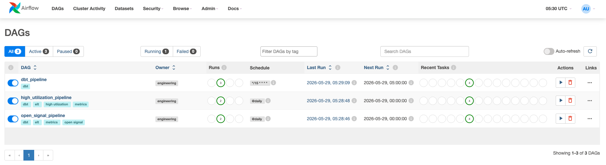
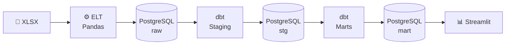
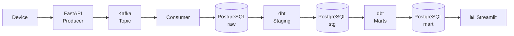
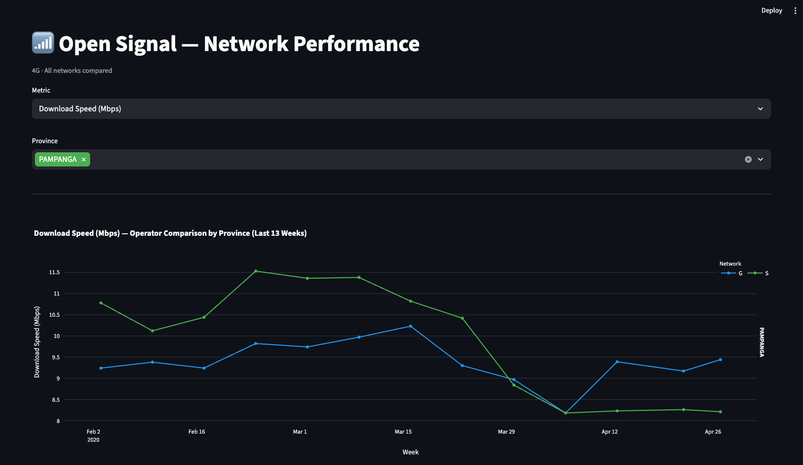
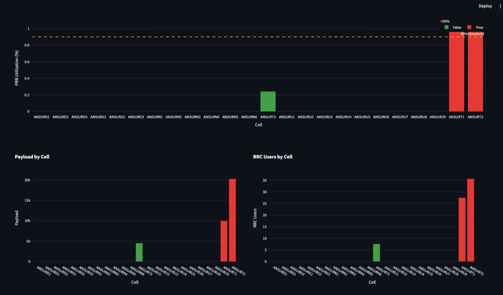
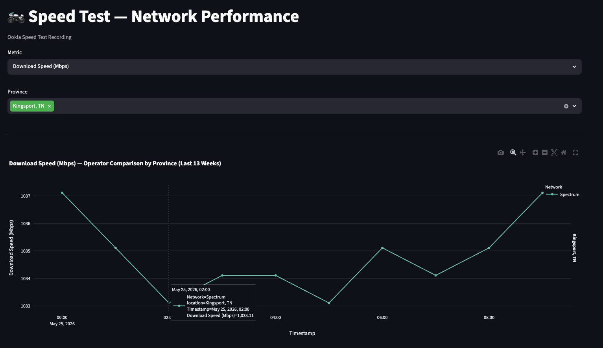

# Service Metrics Pipeline

A locally hosted end-to-end data pipeline designed for team use in analysing network service metrics. The pipeline ingests raw network performance data, transforms it through a series of stages, and presents it via an interactive dashboard accessible to the entire team on a local network.



## Stack
- **Ingestion**: Python + Pandas, FastAPI + Confluent Kafka
- **Storage**: PostgreSQL
- **Orchestration**: Apache Airflow
- **Transformation**: dbt
- **Visualization**: Streamlit + Plotly

## Data Flow

### Batch (Open Signal)


### Streaming (Speed Test)


## Dashboard

Accessible via browser on the local network at `http://localhost:8501`.

Built with Streamlit and Plotly, the dashboard reads from the mart layer.

### Available Dashboards

- Open Signal



- High Utilization



- Speed Test



## Structure
```
service_metrics_pipeline/
├── airflow/
│   └── dags/
├── elt/
├── kafka/
├── service_metrics_dbt/
├── dashboard/
│   └── pages/
├── data/
├── docker-compose.yml
├── .env.*
```

>Default Credentials: admin:admin

## Getting Started

### 1. Configure environment variables

Copy and fill in the env each files:
```bash
cp .env.example .env
```

### 2. Start all services
```bash
docker compose up --build
```

### 3. Access
| Service          | URL                   |
|------------------|-----------------------|
| Airflow          | http://localhost:8080 |
| Dashboard        | http://localhost:8501 |
| Producer API     | http://localhost:8000/docs |

## Commands

### Rebuilding a single service
```bash
docker compose up --build <service_name>
```

### Shutting down
```bash
docker compose down
```

### Access Postgres instance
```bash
docker exec -it service-metrics-pipeline-metrics_postgres-1 psql -U postgres
```

## Authors

- [Engr. Kirk Alyn Santos](https://github.com/kirkalyn13)

## License

MIT